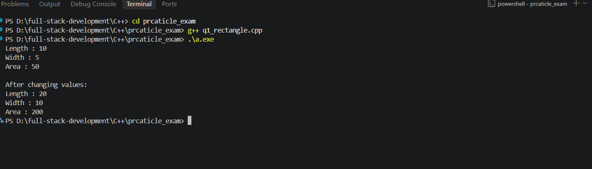
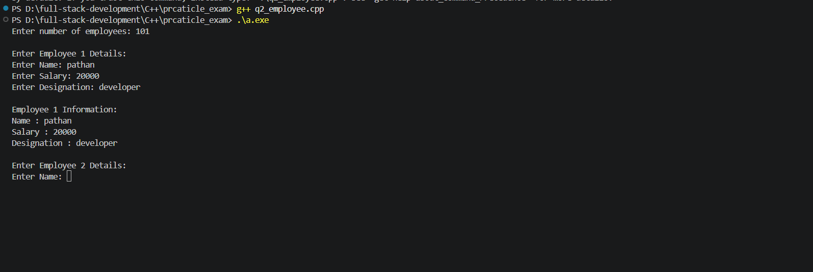
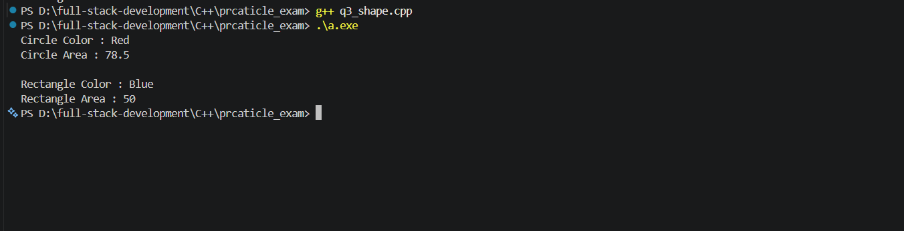
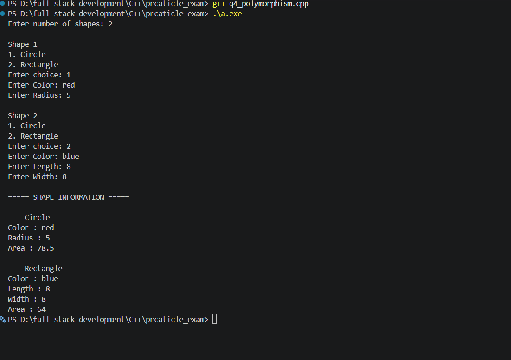
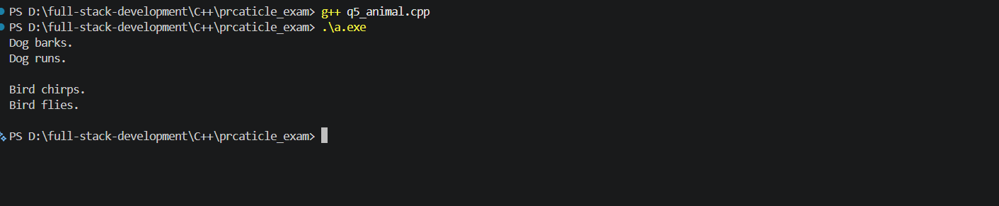

# C++ Object-Oriented Programming — Practical Exam

Practice. Encapsulate. Inherit. Build.

## 1. Overview

A collection of five C++ console programs demonstrating classes, objects, encapsulation, inheritance, abstraction and runtime polymorphism.

Each source file is an independent program with its own `main()` function. The examples progress from a rectangle class with getters and setters to arrays of base-class pointers calling overridden functions.

**Status:** all five implementations and their output screenshots are included in the project.

## 2. Objectives

- Define classes with private attributes and public member functions.
- Initialize objects using parameterized constructors.
- Access and update private data through getters and setters.
- Reuse base-class functionality through inheritance.
- Define abstract classes using pure virtual functions.
- Override functions in concrete derived classes.
- Demonstrate runtime polymorphism using base-class pointers.
- Manage dynamically allocated objects and pointer arrays.

## 3. Technology Stack

| Technology / Tool | Purpose |
| --- | --- |
| C++11 or later | Classes, inheritance, virtual functions and `override` |
| `iostream` | Console input and output |
| `string` | Employee names, designations and shape colors |
| G++ | Compile the individual C++ programs |
| Visual Studio Code | Edit source files and use the terminal |
| Windows PowerShell | Compile and run the programs on Windows |

## 4. Project Files

Save this `README.md` inside the `prcaticle_exam` folder, alongside the source files. This keeps the screenshot links correct.

| File | Description |
| --- | --- |
| `q1_rectangle.cpp` | Rectangle class, setters, getters and area |
| `q2_employee.cpp` | Employee encapsulation with user input |
| `q3_shape.cpp` | Abstract Shape class with Circle and Rectangle |
| `q4_polymorphism.cpp` | Shape pointer array and virtual display functions |
| `q5_animal.cpp` | Abstract Animal class with Dog and Bird |
| `output/q1.png` | Question 1 output screenshot |
| `output/q2.png` | Question 2 output screenshot |
| `output/q3.png` | Question 3 output screenshot |
| `output/q4.png` | Question 4 output screenshot |
| `output/q5.png` | Question 5 output screenshot |

The archive also includes `a.exe`, a compiled executable. Compile the desired source file to run a specific question.

## 5. Q1 — Rectangle Class

### Problem Statement

Define a class named `Rectangle` with private attributes `length` and `width`. Implement public functions to set and get their values and calculate the rectangle's area. Create an object and demonstrate the methods.

### Implementation

- A parameterized constructor initializes `length` and `width`.
- `setLength()` and `setWidth()` update the private attributes.
- `getLength()` and `getWidth()` return their values.
- `area()` returns `length * width`.
- The program creates a rectangle with length `10` and width `5`, then changes them to `20` and `10` through the setters.

### Expected Results

| Stage | Length | Width | Area |
| --- | --- | --- | --- |
| Initial values | 10 | 5 | 50 |
| After changing values | 20 | 10 | 200 |

### Concepts Used

Classes, objects, private attributes, public methods, constructors and encapsulation.

### Output Screenshot



## 6. Q2 — Employee Encapsulation

### Problem Statement

Define an `Employee` class with private attributes `name`, `salary` and `designation`. Implement public setter and getter functions and demonstrate access through these functions.

### Implementation

- The constructor initializes the employee attributes.
- `setName()`, `setSalary()` and `setDesignation()` assign user-entered values.
- `getName()`, `getSalary()` and `getDesignation()` display the stored details.
- The user enters the number of employees and provides details for each employee.
- `getline(cin >> ws, ...)` accepts names and designations containing spaces.

One employee object is created and displayed during each loop iteration. The program does not retain all employee objects together in an array.

### Concepts Used

Encapsulation, constructors, strings, setters, getters, user input and loops.

### Output Screenshot



## 7. Q3 — Shape Abstraction

### Problem Statement

Define a base class `Shape` with private attributes `color` and `area`, public access functions and an area calculation method. Derive `Circle` and `Rectangle` and implement their area calculations.

### Implementation

- `Shape` stores private `color` and `area` attributes.
- Public setters and getters provide access to these attributes.
- `virtual void calculateArea() = 0;` makes `Shape` abstract.
- `Circle` overrides `calculateArea()` using the circle formula.
- `Rectangle` overrides `calculateArea()` using the rectangle formula.
- The program creates a red circle with radius `5` and a blue rectangle with length `10` and width `5`.

### Area Formulas

| Shape | Formula used in code | Example result |
| --- | --- | --- |
| Circle | `3.14f * radius * radius` | 78.5 |
| Rectangle | `length * width` | 50 |

### Concepts Used

Inheritance, abstraction, pure virtual functions, function overriding and constructor initialization lists.

### Output Screenshot



## 8. Q4 — Shape Runtime Polymorphism

### Problem Statement

Extend the Shape hierarchy with a virtual `display()` function. Implement shape-specific display functions and create an array of `Shape` pointers pointing to different shape objects. Call `display()` for each object to demonstrate polymorphism.

### Implementation

- `Shape` declares pure virtual `calculateArea()` and `display()` functions.
- `Circle` displays its color, radius and calculated area.
- `Rectangle` displays its color, length, width and calculated area.
- The user enters the number of shapes and selects Circle or Rectangle for each one.
- `Shape **shapes = new Shape *[n];` creates an array of base-class pointers.
- Objects are created with `new Circle(...)` or `new Rectangle(...)`.
- A loop calls `calculateArea()` and `display()` through the base-class pointers.
- The actual object type determines which overridden functions run.

### Memory Management

`delete shapes[i];` releases each dynamically allocated shape object. The virtual destructor in `Shape` supports deletion through a base-class pointer. `delete[] shapes;` then releases the pointer array.

### Concepts Used

Runtime polymorphism, abstract classes, virtual functions, overriding, pointer arrays, dynamic allocation and virtual destructors.

### Output Screenshot



## 9. Q5 — Animal Abstraction and Polymorphism

### Problem Statement

Define an abstract class `Animal` with virtual functions `sound()` and `move()`. Implement concrete classes `Dog` and `Bird`. Create an array of `Animal` pointers and call both functions for each object.

### Implementation

- `Animal` declares pure virtual `sound()` and `move()` functions.
- `Dog` implements barking and running behavior.
- `Bird` implements chirping and flying behavior.
- `Dog d;` and `Bird b;` create local objects.
- `Animal *animals[2] = {&d, &b};` stores their addresses.
- A loop calls both functions through the `Animal` pointers.

These objects and the pointer array use automatic storage, so this program does not require `delete` or `delete[]`.

### Expected Output

```text
Dog barks.
Dog runs.

Bird chirps.
Bird flies.
```

### Concepts Used

Abstract classes, pure virtual functions, inheritance, overriding, base-class pointers and runtime polymorphism.

### Output Screenshot



## 10. Example Inputs

Questions 1, 3 and 5 use predefined objects and do not ask for input.

For Question 2, an example employee entry is:

```text
Enter number of employees: 1
Enter Name: Mohammed Ali
Enter Salary: 25000
Enter Designation: Developer
```

For Question 4, enter two shapes to demonstrate both derived classes:

| Prompt | First shape | Second shape |
| --- | --- | --- |
| Shape choice | 1 — Circle | 2 — Rectangle |
| Color | Red | Blue |
| Radius | 5 | Not requested |
| Length | Not requested | 10 |
| Width | Not requested | 5 |

The resulting areas are `78.5` for the circle and `50` for the rectangle.

## 11. Learning Outcomes

After completing these programs, I learned:

- How to organize data and behavior within a class.
- How private attributes and public functions demonstrate encapsulation.
- How constructors initialize objects.
- How derived classes reuse base-class functionality.
- How pure virtual functions define an abstract interface.
- How derived classes implement their own behavior through overriding.
- How a base-class pointer calls the appropriate derived-class function.
- How to release dynamically allocated objects and arrays.

## 12. Current Scope

These programs are educational console demonstrations. Data is kept in memory and is not saved after exit. Numeric input is expected to be valid; comprehensive input validation is not implemented. Question 4 checks for a non-positive shape count and retries unsupported numeric menu choices.

## 13. Assignment Information

| Item | Details |
| --- | --- |
| Assignment | C++ Practical Exam |
| Topic | Object-Oriented Programming |
| Language | C++ |
| Total programs | 5 |
| Output screenshots | 5 |
| Main concepts | Encapsulation, inheritance, abstraction and polymorphism |

## 14. Author

**mohammed alikhan**

## 15. Conclusion

This practical demonstrates core object-oriented programming concepts through Rectangle, Employee, Shape and Animal examples. The five programs show how private data, public methods, abstract classes and virtual functions work together to create reusable class hierarchies and demonstrate runtime polymorphism.
